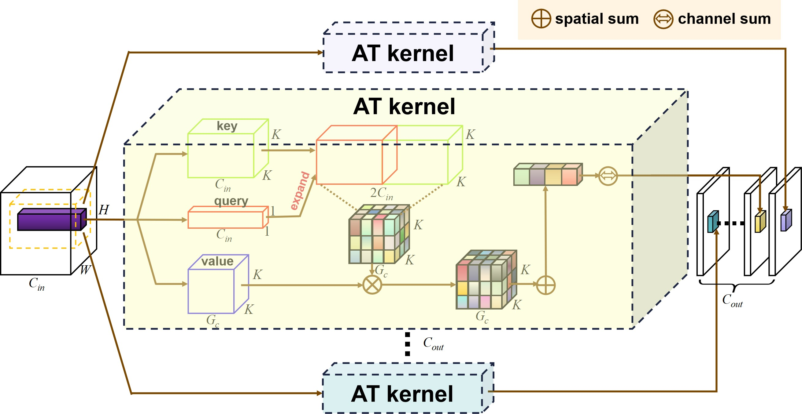

# AT-kernel


official implementation of AT kernel proposed in [AT kernel: Unification of Convolution and Self-attention for Visual Recognition](arXiv_ToBeFixed)

<p align="center"></p>


This project is based on the [OpenMMLab](https://openmmlab.com/). Please install the [mmclassification](https://github.com/open-mmlab/mmclassification) and [mmdetection](https://github.com/open-mmlab/mmdetection) to get started


## Classification on ImageNet

Install the mmclassification with the guidance of [mmcls](https://github.com/Koooko96/mmclassification/blob/master/docs/install.md). (Our environment: mmcls=0.12.0, mmcv-full=1.3.4, pytorch=1.7.1+cu101, cuda=10.1)

After then merge the the files under the mmclassification in this project into the official mmclassification. 

If you want to implement on small size dataset within limited GPU resources, the tiny imagenet dataset can be downloaded in [CS231n_tinyimagenet](http://cs231n.stanford.edu/tiny-imagenet-200.zip)

Remember to register the model'ResNet_ATkernel' and dataset'Tiny_ImageNet' in each corresponding `__init__.py`

Remember to change the data path in config file


- Example of Tiny Imagenet

train: bash tools/dist_train.sh configs/tiny_imagenet/R26_at_1000_11_k3_g4_b32x2_tinyimagenet_cosinelr_100e.py 2 (for 2 GPU training, use python tools/train.py if use single GPU to train)

test: python tools/test.py configs/tiny_imagenet/R26_at_1000_11_k3_g4_b32x2_tinyimagenet_cosinelr_100e.py 'trained model'([Our trained model](https://drive.google.com/file/d/142eLQyIIrxYg8S1aMp3PWBaOtsEyvgUY/view?usp=sharing)) --gpu-ids 0 --metrics accuracy

- Example of Imagenet

train: bash tools/dist_train.sh configs/imagenet/R50_at_0001_11_k3_g4_b128x4_imagenet_cosinelr_100e.py 4

test: python tools/test.py configs/imagenet/R50_at_0001_11_k3_g4_b128x4_imagenet_cosinelr_100e.py 'trained model'([Our trained model](https://drive.google.com/file/d/1r4TJw7bBKai3iXFKp2rXqL9Hhuo_izes/view?usp=sharing)) --gpu-ids 0 --metrics accuracy

and you will get 'accuracy_top-1 : 77.93'


## Detection and Segmentation on COCO dataset
Install the mmdetection with the guidance of [mmdet](https://github.com/open-mmlab/mmdetection/blob/master/docs/en/get_started.md). (Our environment: mmdet=2.14.0, mmcv-full=1.3.12, pytorch=1.7.0, cuda=10.1)

After then merge the the files under the mmdetection in this project into the official mmdetection. 

Remember to register the model'ResNet_ATkernel' in corresponding `__init__.py`

Remember to change the data path and imagenet-pretrained model path in config file

According to our inattention, you have to modify the source code of mmcv/runner/checkpoint.py line 67 "def load(module, prefix=''):" to "def load(module, prefix='backbone.'):" to successfully load the imagenet-pretrained model. And remember to retreat this changing when you load other model. 


- Example of COCO

train: bash tools/dist_train.sh configs/faster_rcnn_r50_AT_0001_11_fpn_1x_b4x2_coco.py 2

test: python tools/test.py configs/faster_rcnn_r50_AT_0001_11_fpn_1x_b4x2_coco.py 'trained model'([Our trained model](https://drive.google.com/file/d/1r0EOs1xdvuaWRWsuk_Ee1NU7Ge3dA_bS/view?usp=sharing)) --eval bbox

and you will get '0.388 0.605 0.420 0.236 0.428 0.506'


If you find this work useful, please cite:
```
To Be Fixed
```